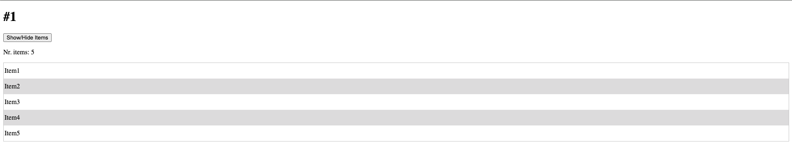
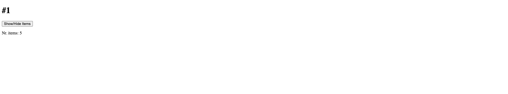
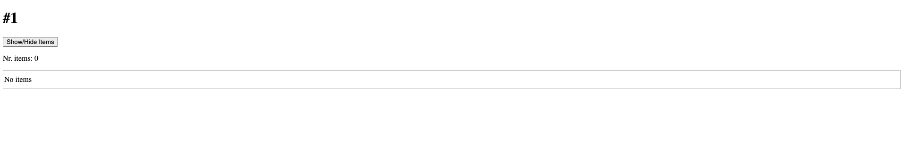

# Problema 1

**Descrição:** 
O component `app-parent` tem como funcionalidade esconder ou mostrar os seus elementos filho.

Parent:
- Deve receber uma lista de strings do `app-root`;
- Deve mostrar o numero de elementos que a lista contém;
- Deve implementar um botão para esconder ou mostrar os seus items; Estes itens são os elementos recebidos na lista;
- Por defeito deve mostrar os elementos da lista;

Child:
- Deve mostrar a string do elemento enviado pelo `app-parent`;
- O elemento no index impar deve aplicar como background a cor `#E8DEF8` já existente na class `.odd`;

Cenário lista vazia:
- No cenário em que o `app-root` envia uma lista vazia deve ser criado deve ser mantido todo o comportamento definido anteriormente. No entanto deve ser criado um `app-child` com o valor `No items`

 
 
 
 

# Resultados esperados

**Input:** items = ['Item1', 'Item2', 'Item3', 'Item4', 'Item5'];

**Default**

**Esconder itens:**

**Input:** items = [];

**Default**

**Esconder itens:**

